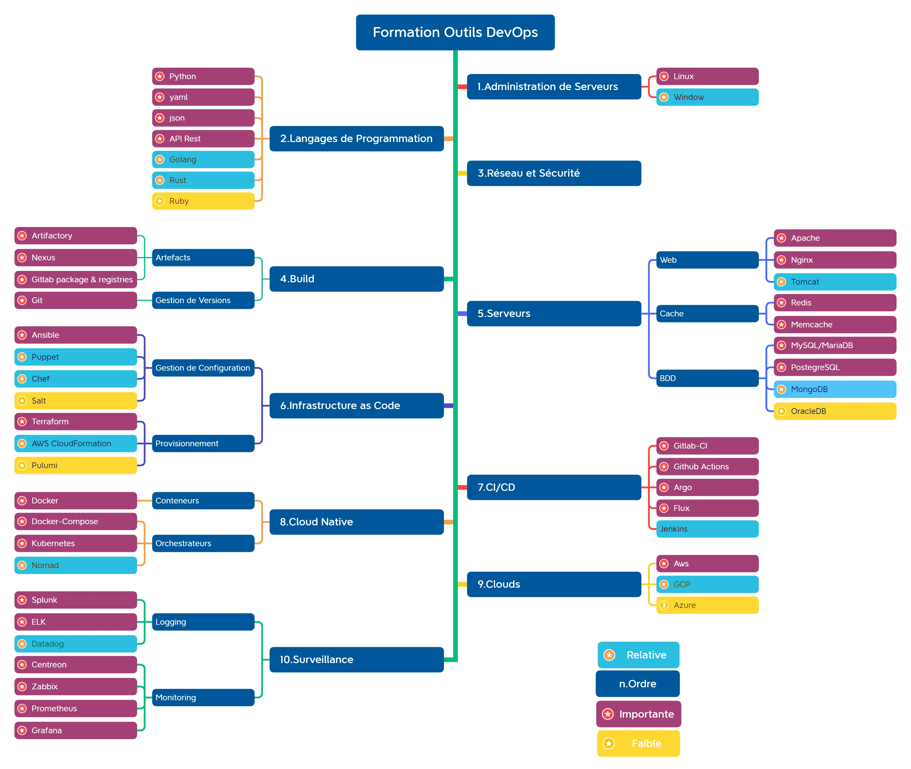

# Awesome French Devops 

<!-- vscode-markdown-toc -->
* 1. [Introduction](#Introduction)
* 2. [Liens vers les catégories d'outils](#Liensverslescatgoriesdoutils)
	* 2.1. [Administration de serveurs](/admin-serveurs/README.md)
	* 2.2. [Langages de Programmation](/langages-programmation/README.md)
	* 2.3. [Réseaux et Sécurité Informatique](/reseau-securite/README.md)
	* 2.4. [Configuration et maintenance de Serveurs](/gestion-configuration/README.md)
	* 2.5. [Infrastructure as Code](/infra-as-code/README.md)
	* 2.6. [Pipelines de CI/CD :](/ci-cd/README.md)
	* 2.7. [Conteneurs et Orchestrateurs](/conteneur-orchestration/README.md)
	* 2.8. [Clouders](/cloud/README.md)
	* 2.9. [Surveillance](/surveillance/README.md)
* 3. [Blogs Devops](#BlogsDevops)
	* 3.1. [Blogs Perso](#BlogsPerso)
	* 3.2. [Sociétés](#Socits)
* 4. [Communautés](#Communauts)
* 5. [Chaines Youtube](#ChainesYoutube)
* 6. [Des comptes Twitters](#DescomptesTwitters)

<!-- vscode-markdown-toc-config
	numbering=true
	autoSave=true
	/vscode-markdown-toc-config -->
<!-- /vscode-markdown-toc -->
##  1. Introduction

**C'est une question qui revient souvent. Comment je démarre si je veux maîtriser
les outils Devops ? Par quoi dois-je commencer ?**

Je parle bien d'outils DevOps et non de la culture elle-même. Si vous êtes
intéressé par ce seul sujet je vous conseille de suivre les liens ci-dessous.

- [Découvrez la méthodologie DevOps sur
  OpenClassRooms](https://openclassrooms.com/fr/courses/6093671-decouvrez-la-methodologie-devops)
- [Mieux comprendre DevOps](https://aws.amazon.com/fr/devops/what-is-devops/)

Par contre, pour **mettre en œuvre avec succès le DevOps** on se doit de
connaître un **certain nombre d'outils**. Pour rappel, **l'approche DevOps** met
l'accent sur **l'automatisation des processus** de **développement de
logiciels** tels que la **construction (build)**, les **tests**, la **mise en
production**, les **mesures** et la **détection d'incidents**, ...

C'est dans ce cadre que vous serez amener à connaître un certain nombre de
ces outils. Je vous propose ce **mind-map** qui représente un peu tous les
outils que vous serez amené à **rencontrer le plus souvent** :

- **en rouge** les plus courants
- **en orange** moins courants
- **en jaune** très peu rencontrés (mais c'est bien de les connaître de nom)

_Si vous débutez il faut suivre l'ordre indiqué par les nombres devant les
grands sujets :_

1. **Administration de serveurs** : Savoir configurer et dépanner un serveur Linux ou
   Windows
2. **Langages de Programmation** : Savoir écrire des petits programmes
3. **Connaitre les rudiments des réseaux et de la Sécurité Informatique** (Adresse
   IP, Firewalls, Routage)
4. **Configuration et maintenance de serveurs** : WEB, Cache et de Base de Données.
5. **Savoir écrire du code d'infrastructure**
6. **Savoir écrire des pipelines de CI/CD**
7. **Savoir construire et Orchestrer des conteneurs** (applications cloud native)
8. **Connaître les principaux Clouders**.
9. **Mise en place d'outils de Surveillance et de Centralisation de logs**

Vous pouvez démarrer plusieurs sujets en parallèle, mais pas trop tout de même.
Par exemple pour la partie Administration de Serveurs vous pouvez lire en //
la configuration réseau. Vous pouvez aussi regarder la construction de VM avec
**Vagrant** pour réaliser vos exercices.

Pour vous aider je vais mettre ci-dessous rapidement toute une série de liens
menant soit vers des sites, soit des livres (**en cours d'élaboration**) :

##  2. Liens vers les catégories d'outils

###  2.1. [Administration de serveurs](/admin-serveurs/README.md)
###  2.2. [Langages de Programmation](/langages-programmation/README.md)
###  2.3. [Réseaux et Sécurité Informatique](/reseau-securite/README.md)
###  2.4. [Configuration et maintenance de Serveurs](/gestion-configuration/README.md)
###  2.5. [Infrastructure as Code](/infra-as-code/README.md)
###  2.6. [Pipelines de CI/CD :](/ci-cd/README.md)
###  2.7. [Conteneurs et Orchestrateurs](/conteneur-orchestration/README.md)
###  2.8. [Clouders](/cloud/README.md)
###  2.9. [Surveillance](/surveillance/README.md)

##  3. Blogs Devops

Voici une liste non exhaustive ou vous trouverez de bons articles sur les **outils
Devops**.

###  3.1. Blogs Perso

- [Zwindler's Reflection](https://blog.zwindler.fr/)
- [Bruno Levasseur](https://blog.levassb.ovh/)
- [damyr](https://www.damyr.fr)
- [dadall](https://www.dadall.info)
- [tferdinand](https://tferdinand.net)
- [grottedubarbu](https://www.grottedubarbu.fr)
- [jesuisundev](https://www.jesuisundev.com)
- [la forge](https://lafor.ge/)

###  3.2. Sociétés

- [linkvalue](https://blog.link-value.fr/)
- [eleven-labs](https://blog.eleven-labs.com)
- [d2si](https://blog.d2si.io)
- [wescale](https://blog.wescale.fr)
- [ovh](https://www.ovh.com/blog)
- [scaleway](https://blog.scaleway.com)
- [journalduhacker](https://www.journalduhacker.net)
- [Claranet notsosecure](https://notsosecure.com/blog)
- [publicissapient](http://blog.engineering.publicissapient.fr)
- [eazytraining](https://eazytraining.fr/blog/)

##  4. Communautés

- [Compagnons du Devops](https://www.compagnons-devops.fr/)

##  5. Chaines Youtube

- [Xavki](https://www.youtube.com/c/xavki-linux)
- [Compagnons du Devops](https://www.youtube.com/c/LesCompagnonsduDevOps)
- [Cloud Nord](https://www.youtube.com/channel/UCD_iUcnDZgFlU_7fBmWH3tA)

##  6. Des comptes Twitters

- [Aurélie Vache](https://mobile.twitter.com/aurelievache)
- [Katia HIMEUR TALHI](https://mobile.twitter.com/katia_tal)
