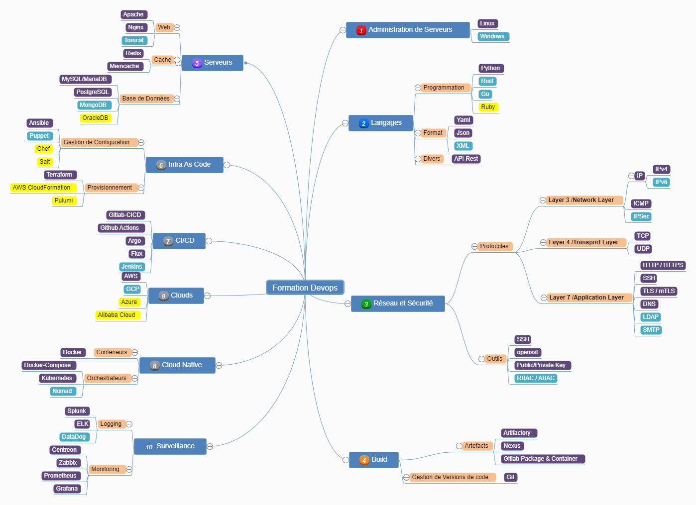

# Awesome French Devops 

🚩 Soutenez ce projet en y mettant simplement une petite étoile. 🌟

<!-- vscode-markdown-toc -->
* 1. [Introduction](#Introduction)
* 2. [Liens vers les catégories d'outils](#Liensverslescatgoriesdoutils)
	* 2.1. [Administration de serveurs](/admin-serveurs/README.md)
	* 2.2. [Langages de Programmation](/langages-programmation/README.md)
	* 2.3. [Réseaux et Sécurité Informatique](/reseau-securite/README.md)
	* 2.4. [Configuration et maintenance de Serveurs](/configuration-serveurs/README.md)
	* 2.5. [Infrastructure as Code](/infra-as-code/README.md)
	* 2.6. [Pipelines de CI/CD](/ci-cd/README.md)
	* 2.7. [Conteneurs et Orchestrateurs](/conteneur-orchestration/README.md)
	* 2.8. [Clouders](/cloud/README.md)
	* 2.9. [Surveillance](/surveillance/README.md)
* 3. [Sites parlant du Devops](#SitesDevops)
	* 3.1. [Blogs Perso](#BlogsPerso)
	* 3.2. [Sociétés](#Socits)
	* 3.3. [Articles](#Articles)
* 4. [Livres](#Livres)
* 5. [Communautés](#Communauts)
* 6. [Mooc](#Mooc)
* 7. [Chaines Youtube](#ChainesYoutube)
* 8. [Chaines Twitch](#ChainesTwitch)
* 9. [Des comptes Mastodon](#DescomptesMastodon)
* 10. [Des comptes Twitters](#DescomptesTwitters)
* 11. [Des slacks](#Desslacks)
* 12. [Podcasts](#Podcasts)
* 13. [Conférences](#Conferences)
  * 13.1 [Les chaines Youtube des conférences](#videosconf)
* 14. [Contribuer](#Contribuer)
  * 14.1. [Lignes directrices](#Lignesdirectrices)

<!-- vscode-markdown-toc-config
	numbering=true
	autoSave=true
	/vscode-markdown-toc-config -->
<!-- /vscode-markdown-toc -->
##  1. Introduction

**Comme je ne reçois plus de contribution, j'ai décidé de construire [une
section documentation sur mon blog
perso](https://blog.stephane-robert.info/docs/) qui reprend tout ce contenu et
plus.**

Ce dépôt a pour objectifs de :

* d'aider à démarrer sa formation et à monter en compétences sur la culture et
  les outils DevOps. Il y a une petite roadmap décrivant le parcours pour les
  débutants.
* recenser tous les liens pointant sur du contenu en Français pour remplir cet
  objectif.

**C'est une question qui revient souvent. Comment je commence si je veux
maîtriser les outils Devops ? Par quoi dois-je commencer ?**

Pour **mettre en œuvre avec succès le DevOps** on se doit de connaître un
**certain nombre d'outils**. Pour rappel, **l'approche DevOps** met l'accent sur
**l'automatisation des processus** de **développement de logiciels** tels que la
**construction (build)**, les **tests**, la **mise en production**, les
**mesures** et la **détection d'incidents**, ...

C'est dans ce cadre que vous serez amené à connaître un certain nombre de
ces outils. Je vous propose ce **mind-map** qui représente un peu tous les
outils que vous serez amené à **rencontrer le plus souvent** :

* **en violet** les plus courants
* **en bleu** les moins courants
* **en jaune** les très peu rencontrés (mais c'est bien de les connaître de nom)

_Si vous débutez il faut suivre l'ordre indiqué par les nombres devant les
grands sujets_

_Si vous ne connaissez absolument rien au devops commencez par lire ces
[Livres](#Livres) ou suivre ces [Mooc](#Mooc)._

1. **Administration de serveurs** : Savoir configurer et dépanner un serveur Linux ou
   Windows
2. **Langages de Programmation** : Savoir écrire des petits programmes
3. **Connaitre les rudiments des réseaux et de la Sécurité Informatique** (Adresse
   IP, Firewalls, Routage)
4. **Configuration et maintenance de serveurs** : WEB, Cache et de Base de Données.
5. **Savoir écrire du code d'infrastructure**
6. **Savoir écrire des pipelines de CI/CD**
7. **Savoir construire et Orchestrer des conteneurs** (applications cloud native)
8. **Connaître les principaux Clouders**.
9. **Mise en place d'outils de Surveillance et de Centralisation de logs**

Vous pouvez démarrer plusieurs sujets en parallèle, mais pas trop tout de même.
Par exemple pour la partie Administration de Serveurs vous pouvez lire en //
la configuration réseau. Vous pouvez aussi regarder la construction de VM avec
**Vagrant** pour réaliser vos exercices.

Pour vous aider je vais mettre ci-dessous rapidement toute une série de liens
menant soit vers des sites, soit des livres (**en cours d'élaboration**) :

##  2. Liens vers les catégories d'outils

###  2.1. [Administration de serveurs](/admin-serveurs/README.md)
###  2.2. [Langages de Programmation](/langages-programmation/README.md)
###  2.3. [Réseaux et Sécurité Informatique](/reseau-securite/README.md)
###  2.4. [Configuration et maintenance de Serveurs](/configuration-serveurs/README.md)
###  2.5. [Infrastructure as Code](/infra-as-code/README.md)
###  2.6. [Pipelines de CI/CD](/ci-cd/README.md)
###  2.7. [Conteneurs et Orchestrateurs](/conteneur-orchestration/README.md)
###  2.8. [Clouders](/cloud/README.md)
###  2.9. [Surveillance](/surveillance/README.md)

##  3. Sites parlant du Devops

Voici une liste non exhaustive où vous trouverez de bons articles sur les
**outils Devops**. Regardez dans le dépôt, j'y ai déposé mon export
[feedly](https://feedly.com/) avec tous les flux RSS et Atom que je suis pour
faire ma veille techno. Je la mettrai à jour régulièrement. [feedly.opml](./feedly.opml)

###  3.1. Blogs Perso

* [Antoine Mayer](https://blog.antoinemayer.fr/)
* [Bruno Levasseur](https://blog.levassb.ovh/)
* [dadall](https://www.dadall.info)
* [damyr](https://www.damyr.fr)
* [filador](https://blog.filador.fr)
* [Frédéric Léger](https://www.webofmars.com/blog/)
* [grottedubarbu](https://www.grottedubarbu.fr)
* [Idriss Neumann](https://www.ineumann.fr)
* [jesuisundev](https://www.jesuisundev.com)
* [la forge](https://lafor.ge/)
* [mcorbin](https://www.mcorbin.fr/)
* [Rémi Verchère](https://www.vrchr.fr/)
* [scalastic](https://scalastic.io/)
* [Stephane Philippart](https://philippart-s.github.io/blog)
* [Stephane ROBERT](https://blog.stephane-robert.info/)
* [tferdinand](https://tferdinand.net)
* [Une-tasse-de-café](https://une-tasse-de.cafe/)
* [Zwindler's Reflection](https://blog.zwindler.fr/)

###  3.2. Sociétés

* [April : Promouvoir et défendre le logiciel libre](https://april.org/)
* [Bearstech](https://bearstech.com/societe/blog/)
* [Blackcreeper](https://www.blackcreeper.com/blog/)
* [Cockpit.io](https://blog.cockpitio.com/)
* [Devoteam Revolve](https://blog.revolve.team/)
* [EasyTeam](https://easyteam.fr/blog/)
* [Eazytraining](https://eazytraining.fr/blog/)
* [Eleven Labs](https://blog.eleven-labs.com)
* [Enix](https://enix.io/fr/blog/)
* [Ippon](https://blog.ippon.fr)
* [Le Journal Du Hacker](https://www.journalduhacker.net)
* [LinkValue](https://blog.link-value.fr/)
* [NotSoSecure Claranet Cyber Security](https://notsosecure.com/blog)
* [OVHcloud](https://blog.ovhcloud.com/)
* [Publicis Sapient](http://blog.engineering.publicissapient.fr)
* [Red Hat](https://www.redhat.com/fr/blog)
* [Scaleway](https://blog.scaleway.com)
* [Soat](https://blog.soat.fr)
* [Wescale](https://blog.wescale.fr)
* [Zenika](https://blog.zenika.com/)
* [Webofmars](https://www.webofmars.com/blog/)

###  3.3. Articles

* [Mieux comprendre DevOps](https://aws.amazon.com/fr/devops/what-is-devops/)
* [Accelerate vu par Zenika](https://blog.zenika.com/2021/08/18/accelerate-vu-par-zenika/)

##  4. Livres

* [Découvrir DevOps - 2e éd. - L'essentiel pour tous les métiers : L'essentiel pour tous les métiers](https://amzn.to/3roccO9)
* [Mettre en œuvre DevOps - 3e éd. - Comment évoluer vers une DSI agile :
  Comment évoluer vers une DSI agile Broché](https://amzn.to/3e0d4pg)
* [DevOps - Intégrez et déployez en continu](https://amzn.to/3fRVnsA) de Ernesto Leite
* [Automatisation : de Python à Ansible](https://pressbooks.pub/automatisation/) de Alex Faivre & Gilbert Moïsio

##  5. Communautés

* [Le chalet](https://discord.gg/sHXFNWzz)
* [Compagnons du Devops](https://www.compagnons-devops.fr/)
* [SRE France](https://sre-france.github.io/)
* [DevObs](https://discord.gg/kKUty5pfCQ)
* [OpenBaR - build-and-run](https://bit.ly/2RmZttz)
* [France DevOps](https://www.francedevops.fr/)

##  6. Mooc

* [DevOpsSec](https://devopssec.fr/category/comprendre-le-devops)
* [Découvrez la méthodologie DevOps sur
  OpenClassRooms](https://openclassrooms.com/fr/courses/6093671-decouvrez-la-methodologie-devops)
* [Devenir Devops (vidéos) par
  xavki](https://www.youtube.com/playlist?list=PLn6POgpklwWrBPMKFniOiMyLMdxlgFhrG)
  60 vidéos

##  7. Chaines Youtube

* [Aurelie Vache](https://www.youtube.com/channel/UCrRk0kOP58lBMl9B8ZS8Vlg)
* [CocAdmin](https://www.youtube.com/c/cocadmin)
* [Compagnons du Devops](https://www.youtube.com/c/LesCompagnonsduDevOps)
* [ComWorkIO](https://www.youtube.com/@comworkio)
* [Cookie Connecté](https://www.youtube.com/channel/UC5cs06DgLFeyLIF_II7lWCQ)
* [Cloud Nord](https://www.youtube.com/channel/UCD_iUcnDZgFlU_7fBmWH3tA)
* [Devoxx FR](https://www.youtube.com/c/DevoxxFRvideos)
* [Emile `iMil' Heitor](https://www.youtube.com/channel/UCqGZmYTiWmOl7vXb0XBbY_Q)
* [France DevOps](https://www.youtube.com/channel/UC7Mwqt8IODoaQONPwMrOYQA)
* [GCPLearning-ce9bg](https://www.youtube.com/@GCPLearning-ce9bg)
* [Inpulse.tv * Playlist Devops & cloud](https://www.youtube.com/playlist?list=PLORtqNVm6r7BVC3ldqwLK4Nl_FgjwpQpU)
* [KrustyHack](https://www.youtube.com/channel/UCM0mnsNbecIi_IAPXtHb-TA)
* [Le TechLab de Christophe Casalegno](https://www.youtube.com/channel/UCIlCglg-Gl6eNtllSB95gMA)
* [Limawi](https://www.youtube.com/channel/UCxOvLOXTZFhy8NPMsxg5ogw)
* [Naitech](https://www.youtube.com/channel/UCWftacXxXdvOk6MnoggQYug)
* [PhilIT](https://www.youtube.com/@phil_it)
* [Xavki](https://www.youtube.com/c/xavki-linux)

## 8. Chaines Twitch

* [Nidouille77](https://m.twitch.tv/nidouille77)
* [PhilIT](https://m.twitch.tv/philouit)

## 9. <a name='DescomptesMastodon'> Des comptes Mastodon

* [Aurélie Vache](https://k8s.social/@scraly)
* [Damy.R](https://mamot.fr/@DamyR)
* [David Aparicio](https://framapiaf.org/@dadideo)
* [Idriss Neumann](https://mastodon.comwork.io/@idrissneumann)
* [Imrane Substack](https://pouet.chapril.org/@imranesubstack)
* [Katia Himeur Talhi](https://fosstodon.org/@Katia)
* [Mcorbin](https://twtr.plus/users/_mcorbin)
* [Stéphane ROBERT](https://pouet.chapril.org/@robert_stephane)
* [TheBidouilleur](https://mamot.fr/@TheBidouilleur)
* [Xavki](https://twtr.plus/users/xavki_off)
* [Zwindler](https://framapiaf.org/@zwindler)

## 10. Des comptes Twitters

* [Aurélie Vache](https://mobile.twitter.com/aurelievache)
* [Cocadmin](https://twitter.com/cocadmin)
* [DamyR](https://twitter.com/damyr_fr)
* [David Aparicio](https://twitter.com/dadideo)
* [Idriss Neumann](https://twitter.com/idriss_neumann)
* [Imrane](https://twitter.com/ImraneSubstack)
* [Jerôme Petazzoni](https://twitter.com/jpetazzo)
* [Juliette Audema](https://twitter.com/ajuliettedev)
* [Katia HIMEUR TALHI](https://mobile.twitter.com/katia_tal)
* [Mazlum Tosun](https://twitter.com/MazlumTosun3)
* [Mcorbin](https://twitter.com/_mcorbin)
* [Michée Lengronne](https://twitter.com/MicheeLengronne)
* [Nicolas Hug](https://twitter.com/KrustyHack)
* [Olivier Poncet](https://twitter.com/ponceto91)
* [Stéphane ROBERT](https://twitter.com/RobertStphane19)
* [TheBidouilleur](https://twitter.com/TheBidouilleur)
* [wiki-tech](https://wiki-tech.io/)
* [Xavki](https://twitter.com/xavki_off)
* [Zwindler](https://twitter.com/zwindler)

## 11. Des slacks

* [comwork-cloud](https://t.co/kQcXNqtoNZ)

## 12. Podcasts

* [Dans ton kube](https://dtk.p7t.tech/) Parle de Kubernetes
* [DevObs](https://devobs.p7t.tech/) Le magazine et observatoire du DevOps
* [Electro
  Monkeys](https://podcasts.audiomeans.fr/electro-monkeys-0c9902cdaea8/) Les concepts et les technologies cloud natives
* [Émission libre à vous de l'april #154](https://www.libreavous.org/154-devops-le-monde-du-libre-sobriete-energetique)
* [Message à caractère informatique](https://www.clever-cloud.com/fr/podcast/)
* [Radio DevOps](https://lydra.fr/radio-devops/) Le mouvement DevOps
* [WeSpeakCloud](https://www.podcastics.com/podcast/wespeakcloud/) Les
  problématiques complexes comme la sécurité ou le DevOps

## 13. Conférences

* Une liste des conférences DevOps est disponible sur ce dépôt : [saphoooo/impressionnant](https://github.com/saphoooo/impressionnant)
* Plus largement, une liste de toutes les conférences tech (Dev, DevOps, etc) avec les dates de CFP est disponible sur ce dépôt : [scraly/developers-conferences-agenda](https://github.com/scraly/developers-conferences-agenda)

### 13.1 Les chaines youtube des conférences

* [Cloud Nord](https://www.youtube.com/@cloudnord6827)
* [DevoxxFR](https://youtube.com/@DevoxxFRvideos)
* [KCD France](https://www.youtube.com/@KubernetesCommunityDaysFr)

## 14. Contribuer

Vos contributions sont toutes les bienvenues ! Elles doivent être non
commerciales. Je me garde le droit de ne pas accepter certaines demandes.

### 14.1. Lignes directrices

* Ajoutez un lien ou plusieurs par [pull
  request](https://github.com/stephrobert/awesome-french-devops/pulls?q=is%3Apr+is%3Aopen+sort%3Aupdated-desc)
  ou par [Issue](https://github.com/stephrobert/awesome-french-devops/issues?q=is%3Aissue+is%3Aopen+sort%3Aupdated-desc)
* Le lien pointe sur du contenu en Français. Excepté les liens vers les sites
  officiels des produits cités.
* Ajoutez une section si nécessaire.
* Évitez les doublons.
* Vérifiez votre orthographe et votre grammaire.
* Supprimez tout espace blanc de fin.
